# SEO Case Studies & Technical Optimization Projects

This repository showcases my approach to technical SEO, content strategy, and site performance optimization through real and simulated case studies.

I specialize in bridging the gap between **software engineering and SEO**, applying backend logic, automation, and data-driven analysis to improve search visibility and user experience.

---

## My SEO Process

```mermaid
flowchart LR
    A[🔍 Discovery] --> B[📊 Audit]
    B --> C[🎯 Strategy]
    C --> D[⚙️ Implementation]
    D --> E[📈 Measurement]
    E --> F[🔄 Iteration]
    F --> B
```

| Phase | What I Do | Example in This Repo |
|-------|-----------|---------------------|
| **Discovery** | Understand business goals, competitive landscape | Client pitches in Case Study 4 & 5 |
| **Audit** | Technical crawl, content inventory, gap analysis | All audit-report.md files |
| **Strategy** | Keyword research, content planning, roadmaps | seo-strategy.md, content-plan.md |
| **Implementation** | Schema markup, content creation, technical fixes | schema-examples.json, optimized-code-snippet.js |
| **Measurement** | Track rankings, traffic, conversions | before-after-comparison.json files |
| **Iteration** | Refine strategy based on data | Monthly report template |

---

## Case Study Index

| Case Study | Summary | Skills Demonstrated |
|------------|---------|---------------------|
| [Technical SEO Audit](./case-study-1-technical-seo-audit/) | Identified crawl issues, metadata gaps, and Core Web Vitals problems; implemented structured data and site architecture fixes | Screaming Frog, Lighthouse, JSON-LD Schema, GSC |
| [Content Strategy Plan](./case-study-2-content-strategy/) | Created keyword clusters, 3-month content roadmap, and internal linking strategy for SaaS platform | Keyword Research, Content Architecture, Sitemap Analysis |
| [Performance Optimization](./case-study-3-performance-optimization/) | Reduced LCP by 56%, implemented lazy-loading and JavaScript optimizations for marketplace app | PageSpeed, Core Web Vitals, Performance Engineering |
| [Morning Brew Local SEO](./case-study-4-morning-brew-local-seo/) | Built complete digital presence for coffee shop with zero web presence; GMB optimization, local keywords, online ordering strategy | Local SEO, GMB, Schema Markup, Client Pitch |
| [Moon Poke Restaurant SEO](./case-study-5-moon-poke-restaurant-seo/) | Migrated restaurant from third-party ordering to first-party system; projected $10k+ annual savings | Restaurant SEO, Platform Migration, ROI Analysis |
| [Automation Tools](./tools/) | Built metadata checker, SEO audit scripts, and technical playbook | Node.js, Automation, Scripting |
| [Templates](./templates/) | Agency-style templates for roadmaps, reports, and audits | Client Deliverables, Process Documentation |

---

## Tools & Techniques

| Category | Tools & Methods |
|----------|-----------------|
| **Auditing** | Google Search Console, Lighthouse, Screaming Frog SEO Spider |
| **Research** | SEMRush, Keyword Gap Analysis, Topical Clustering |
| **Implementation** | JSON-LD Structured Data, Technical SEO Best Practices |
| **Performance** | Page Speed Optimization, Core Web Vitals (LCP, CLS, TTFB) |
| **Automation** | Node.js Scripts, Programmatic SEO |

---

## Case Studies

### 1. Technical SEO Audit & Fixes (Client Project – Anonymized)

**Issues Identified:**
- Missing alt attributes across ~120 images
- Poor CLS & LCP metrics (layout shift from hero images)
- Incorrect canonical URLs on blog pages
- Duplicate title tags due to pagination
- Orphan pages discovered via crawl map
- Sitemap not submitted in Search Console
- Slow TTFB on `/shop` due to inefficient server logic

**Solutions Implemented:**
- Compressed and lazy-loaded hero images
- Preloaded key font files and implemented caching headers
- Added canonical tags to paginated categories
- Added JSON-LD schema for Product, Breadcrumb, and Logo
- Generated updated XML sitemap and fixed robots.txt
- Introduced metadata validation script

**Results:**

| Metric | Before | After |
|--------|--------|-------|
| Lighthouse Performance Score | 54 | 92 (+38) |
| Indexed Pages | 1,856 | 2,247 (+21%) |
| LCP | 5.2s | 1.8s (-65%) |

| Before | After |
|--------|-------|
|  |  |

*Note: Lighthouse screenshots are placeholder images for demonstration.*

**Related Files:**
- [Full Audit Report](./case-study-1-technical-seo-audit/audit-report.md)
- [JSON-LD Schema Example](./case-study-1-technical-seo-audit/schema-example.json)
- [Technical SEO Checklist](./tools/technical-seo-checklist.md)

---

### 2. AI-Driven Content Strategy for SaaS Platform

**Goal:** Build a 3-month content roadmap to increase visibility for mid-funnel keywords related to productivity and automation.

**Target Keywords:**
- "best productivity templates"
- "AI workflow tools"
- "how to automate small business tasks"

**Actions Taken:**
- Keyword gap analysis and search intent mapping
- Topical clustering and content calendar creation
- Semantic optimization using AI-assisted analysis
- Sitemap analysis and cleanup

**Results:**

| Metric | Before | After (60 days) |
|--------|--------|-----------------|
| Organic Impressions | 12,400/mo | 47,120/mo (+280%) |
| Indexed Pages | 34 | 46 (+12) |
| Blog Traffic | 2,100/mo | 8,400/mo (+300%) |

**Related Files:**
- [Full Content Plan](./case-study-2-content-strategy/content-plan.md)
- [Sitemap Analysis](./case-study-2-content-strategy/sitemap-analysis.md)
- [SEO Playbook](./tools/seo-playbook.md)

---

### 3. Performance Optimization for Marketplace App

**Problem:** Slow time-to-first-byte (TTFB) and render delays on key product pages affecting user experience and SEO.

**Fixes Applied:**
- Implemented image compression (-65% file size reduction)
- Reduced unused JavaScript by splitting bundles (-77%)
- Added HTTP caching headers
- Optimized server logic to reduce TTFB
- Added lazy-loading for images

**Results:**

| Metric | Before | After |
|--------|--------|-------|
| LCP (Largest Contentful Paint) | 4.8s | 2.1s (-56%) |
| CLS (Cumulative Layout Shift) | 0.24 | 0.05 (-79%) |
| TTFB (Time to First Byte) | 1,200ms | 380ms (-68%) |
| PageSpeed Score | 63 | 89 (+26) |

**Related Files:**
- [Full Optimization Report](./case-study-3-performance-optimization/page-seed-report.md)
- [Lazy Loading Code](./case-study-3-performance-optimization/optimized-code-snippet.js)
- [Before/After Metrics (JSON)](./case-study-3-performance-optimization/before-after-comparision.json)

---

### 4. Local SEO Foundation for Coffee Shop (Real Client)

**Client:** The Morning Brew Coffee Shop — 4.9★ rating, 432 reviews, but zero web presence.

**Challenge:** Highly-rated local business completely invisible online. No website, no SEO, relying entirely on Facebook and foot traffic.

**Proposed Solution:**
- Build SEO-optimized website from scratch
- Implement LocalBusiness and Menu schema
- Target local keywords ("coffee near me", "cafe east stroudsburg")
- Launch online ordering and loyalty program
- Optimize Google Business Profile

**Projected Results (90 Days):**

| Metric | Current | Projected |
|--------|---------|-----------|
| Google Search Visibility | 0% | 25+ keywords ranking |
| Indexed Pages | 0 | 15-20 pages |
| Online Orders | None | New revenue channel |
| Email/SMS List | 0 | 500-1,000 contacts |

**Related Files:**
- [Full Case Study](./case-study-4-morning-brew-local-seo/README.md)
- [Audit Report](./case-study-4-morning-brew-local-seo/audit-report.md)
- [Keyword Research](./case-study-4-morning-brew-local-seo/keyword-research.md)
- [6-Month Strategy](./case-study-4-morning-brew-local-seo/seo-strategy.md)
- [Client Pitch](./case-study-4-morning-brew-local-seo/client-pitch.md)

---

### 5. Restaurant SEO & Platform Migration (Real Client)

**Client:** Moon Poke, Sushi & Sweets — 5.0★ rating, but dependent on third-party ordering (MealKeyWay).

**Challenge:** Perfect reviews but generic website, 15-20% of every order going to platform fees, no customer data ownership.

**Proposed Solution:**
- Rebuild with SEO-optimized custom website
- Migrate to first-party ordering (Square/Toast)
- Implement Restaurant and Menu schema
- Build customer database with loyalty program
- Target restaurant keywords ("poke near me", "sushi east stroudsburg")

**Projected Results (6 Months):**

| Metric | Current | Projected |
|--------|---------|-----------|
| Platform Fees | $12k/year | $1.5k/year (save $10.5k) |
| Organic Visibility | Minimal | 60+ keywords ranking |
| Online Orders | 200/mo | 300/mo (+50%) |
| Customer Database | 0 | 1,200+ contacts |

**Related Files:**
- [Full Case Study](./case-study-5-moon-poke-restaurant-seo/README.md)
- [Audit Report](./case-study-5-moon-poke-restaurant-seo/audit-report.md)
- [Keyword Research](./case-study-5-moon-poke-restaurant-seo/keyword-research.md)
- [6-Month Strategy](./case-study-5-moon-poke-restaurant-seo/seo-strategy.md)
- [Client Pitch](./case-study-5-moon-poke-restaurant-seo/client-pitch.md)

---

## Additional Resources

| Resource | Description |
|----------|-------------|
| [Technical SEO Checklist](./tools/technical-seo-checklist.md) | Comprehensive checklist covering indexation, metadata, performance, and structured data |
| [Metadata Audit Script](./tools/metadata-audit-script.js) | Node.js script using `node-fetch` and `cheerio` to extract page metadata from any URL |
| [SEO Playbook](./tools/seo-playbook.md) | Playbook covering crawling, indexation, performance, structured data, and content strategy |
| [6-Month SEO Roadmap Template](./templates/6-month-seo-roadmap.md) | Agency-style template for planning and tracking 6-month SEO engagements |
| [Monthly Client Report Template](./templates/monthly-client-report.md) | Template for monthly SEO reporting with traffic, rankings, and recommendations |
| [SEO Audit Template](./templates/seo-audit-template.md) | Comprehensive audit template covering technical, on-page, content, and local SEO |

---

## How to Use This Repository

**If you're a hiring manager or collaborator:**

1. Start with the [SEO Playbook](./tools/seo-playbook.md) to understand my overall process and methodology
2. Dive into the case studies to see concrete examples of audits, content strategy, and performance optimization
3. Check the [`tools/`](./tools/) folder for scripts and checklists that demonstrate the engineering side of SEO

**If you're an engineer or SEO professional:**

1. Clone the repo and adapt the checklists and scripts for your own projects
2. The [metadata audit script](./tools/metadata-audit-script.js) is ready to run — just install dependencies with `npm install node-fetch cheerio`
3. PRs and suggestions are welcome

---

## About This Repository

This repository demonstrates my ability to combine **engineering skills**, **SEO strategy**, and **business thinking** to drive measurable growth.

Whether it's diagnosing crawl issues, optimizing Core Web Vitals, or building content systems at scale—I approach SEO as both a technical discipline and a growth lever for digital-first organizations.

---

## Contact

Interested in collaborating or have questions about any of these case studies? Feel free to reach out.
