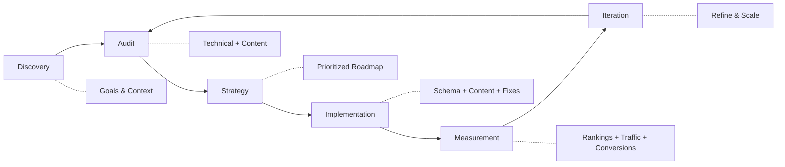

# SEO Technical Playbook

A systematic approach to technical SEO that combines engineering rigor with search optimization strategy. This playbook outlines methodologies, workflows, and measurement frameworks for sustainable organic growth.

---

## SEO Process Overview



| Phase | Key Activities | Deliverables |
|-------|----------------|--------------|
| **Discovery** | Stakeholder interviews, goal alignment, competitive analysis | Project brief, success criteria |
| **Audit** | Technical crawl, content inventory, backlink analysis | Audit report, issue prioritization |
| **Strategy** | Keyword research, content planning, technical roadmap | 6-month roadmap, content calendar |
| **Implementation** | Schema markup, content creation, technical fixes | Deployed changes, documentation |
| **Measurement** | Rank tracking, traffic analysis, conversion monitoring | Monthly reports, dashboards |
| **Iteration** | Performance review, strategy refinement, scaling | Updated priorities, new opportunities |

---

## Quick Reference: Problem → Solution Mapping

| Problem | Artifact / Tool | Location |
|---------|-----------------|----------|
| Need a quick technical audit | Technical SEO Checklist | [`technical-seo-checklist.md`](./technical-seo-checklist.md) |
| Need to scan metadata at scale | Metadata Audit Script | [`metadata-audit-script.js`](./metadata-audit-script.js) |
| Need a 90-day SEO roadmap | This playbook (Strategy → Execute) | Sections 1-6 below |
| Need to measure SEO success | Measurement Framework | Section 7 below |
| Need CI/CD integration for SEO | Deployment Workflow | Section 8 below |
| Need ongoing review process | Review Cadence | Section 9 below |

---

## Table of Contents

1. [Audit Methodology](#1-audit-methodology)
2. [Crawling & Indexation](#2-crawling--indexation)
3. [Performance Optimization](#3-performance-optimization)
4. [Structured Data Strategy](#4-structured-data-strategy)
5. [Programmatic SEO](#5-programmatic-seo)
6. [Content Strategy Framework](#6-content-strategy-framework)
7. [Measurement Framework](#7-measurement-framework)
8. [Deployment Workflow](#8-deployment-workflow)
9. [Review Cadence](#9-review-cadence)
10. [KPIs & Success Metrics](#10-kpis--success-metrics)

---

## 1. Audit Methodology

### Pre-Audit Discovery

Before beginning any technical audit, gather context:

| Information | Source | Purpose |
|-------------|--------|---------|
| Business goals | Stakeholder interview | Align SEO priorities with business objectives |
| Traffic history | GA4, GSC | Identify trends, drops, seasonal patterns |
| Recent changes | Dev team, CMS logs | Correlate issues with deployments |
| Competitor landscape | SEMrush, Ahrefs | Benchmark performance |
| Technical stack | Dev team | Understand constraints and capabilities |

### Audit Phases

#### Phase 1: Automated Crawl (Day 1-2)
```
Tools: Screaming Frog, Sitebulb, or custom crawler
Scope: Full site crawl with JavaScript rendering
Output: Crawl database, issue export, visualization
```

**Crawl Configuration:**
- Respect robots.txt: No (to identify blocked resources)
- JavaScript rendering: Enabled
- Crawl depth: Unlimited
- Follow external links: Yes (one level)

#### Phase 2: Search Console Analysis (Day 2-3)
```
Focus Areas:
- Index Coverage report
- Core Web Vitals
- Mobile Usability
- Crawl Stats
- Manual Actions
```

**Key Questions:**
1. What percentage of submitted URLs are indexed?
2. Are there crawl anomalies (spikes, drops)?
3. Which pages have CWV issues?
4. Are there any manual penalties?

#### Phase 3: Log File Analysis (Day 3-4)
```
Tools: Screaming Frog Log Analyzer, custom scripts
Data Needed: 30-90 days of server logs
```

**Analysis Points:**
- Googlebot crawl frequency by page type
- Crawl budget distribution
- Status codes returned to bots
- Bot behavior vs. sitemap priorities

#### Phase 4: Competitive Gap Analysis (Day 4-5)
```
Tools: Ahrefs, SEMrush, SimilarWeb
Compare: Top 3-5 competitors
```

**Analyze:**
- Keyword gaps (what competitors rank for that you don't)
- Content gaps (topics competitors cover)
- Technical advantages (speed, features, structured data)
- Backlink profile comparison

#### Phase 5: Synthesis & Prioritization (Day 5-7)
```
Output: Prioritized recommendations document
Format: Issue → Impact → Effort → Priority matrix
```

**Prioritization Matrix:**

| Priority | Impact | Effort | Timeline |
|----------|--------|--------|----------|
| P0 - Critical | High | Any | Immediate |
| P1 - High | High | Low-Medium | Week 1-2 |
| P2 - Medium | Medium | Medium | Month 1 |
| P3 - Low | Low | High | Backlog |

---

## 2. Crawling & Indexation

### Robots.txt Strategy

**Standard Template:**
```
User-agent: *
Disallow: /admin/
Disallow: /cart/
Disallow: /checkout/
Disallow: /search?
Disallow: /*?sort=
Disallow: /*?filter=

Sitemap: https://example.com/sitemap.xml
```

**Testing Protocol:**
1. Use Google's robots.txt Tester in GSC
2. Test with `curl -A "Googlebot" https://example.com/robots.txt`
3. Validate critical pages aren't blocked
4. Monitor "Blocked by robots.txt" in GSC

### Sitemap Optimization

**Sitemap Architecture for Large Sites:**
```
sitemap.xml (sitemap index)
├── sitemap-pages.xml (static pages)
├── sitemap-products-1.xml (products 1-50,000)
├── sitemap-products-2.xml (products 50,001-100,000)
├── sitemap-blog.xml (blog posts)
└── sitemap-categories.xml (category pages)
```

**Sitemap Quality Checklist:**
- Only include 200 status, indexable pages
- Update lastmod only when content changes
- Validate with GSC sitemap report
- Remove URLs with <10 visits/year

### Canonicalization Strategy

**Decision Tree:**
```
Is the page the original source?
├── Yes → Self-referencing canonical
└── No → Is there a preferred version?
    ├── Yes → Canonical to preferred
    └── No → Consider noindex or consolidation
```

**Common Scenarios:**

| Scenario | Canonical Strategy |
|----------|-------------------|
| www vs non-www | Pick one, redirect + canonical |
| HTTP vs HTTPS | Always HTTPS, redirect + canonical |
| Trailing slash | Pick one, be consistent |
| Pagination | Self-reference OR canonical to page 1 |
| URL parameters | Canonical to clean URL |
| Mobile (m.) | Canonical to responsive version |

---

## 3. Performance Optimization

### Core Web Vitals Framework

#### LCP Optimization Checklist

```
1. Identify LCP element (Chrome DevTools → Performance)
2. Optimize delivery:
   - Preload critical images: <link rel="preload" as="image" href="...">
   - Use responsive images: srcset, sizes
   - Implement next-gen formats: WebP, AVIF
   - Enable compression: Brotli > Gzip
3. Reduce server time:
   - Implement CDN
   - Enable HTTP/2 or HTTP/3
   - Optimize TTFB (<600ms)
4. Remove render-blocking resources:
   - Defer non-critical JS
   - Inline critical CSS
   - Preconnect to required origins
```

#### CLS Prevention Strategy

```javascript
// Always set explicit dimensions


// Reserve space for dynamic content
.ad-container {
  min-height: 250px;
}

// Use font-display for web fonts
@font-face {
  font-family: 'CustomFont';
  font-display: swap;
  src: url('/fonts/custom.woff2') format('woff2');
}
```

#### Performance Budget

| Resource Type | Budget | Tool to Measure |
|--------------|--------|-----------------|
| Total page weight | < 2MB | WebPageTest |
| JavaScript | < 400KB | Lighthouse |
| CSS | < 100KB | Lighthouse |
| Images | < 1MB | WebPageTest |
| Web fonts | < 100KB | DevTools |
| Third-party | < 500KB | WebPageTest |

### Caching Strategy

**Cache-Control Headers:**
```
# Static assets (versioned)
Cache-Control: public, max-age=31536000, immutable

# HTML pages
Cache-Control: public, max-age=0, must-revalidate

# API responses
Cache-Control: private, max-age=60
```

---

## 4. Structured Data Strategy

### Schema Priority by Page Type

| Page Type | Primary Schema | Secondary Schema |
|-----------|---------------|------------------|
| Homepage | Organization, WebSite | SearchAction |
| Product | Product | BreadcrumbList, AggregateRating |
| Category | CollectionPage | BreadcrumbList |
| Blog Post | Article | BreadcrumbList, Author |
| FAQ | FAQPage | BreadcrumbList |
| How-To | HowTo | BreadcrumbList, VideoObject |
| Local Business | LocalBusiness | OpeningHours, Review |

### Implementation Pattern

```javascript
// Generate JSON-LD dynamically
function generateProductSchema(product) {
  return {
    "@context": "https://schema.org",
    "@type": "Product",
    "name": product.name,
    "description": product.description,
    "image": product.images,
    "sku": product.sku,
    "brand": {
      "@type": "Brand",
      "name": product.brand
    },
    "offers": {
      "@type": "Offer",
      "url": product.url,
      "priceCurrency": "USD",
      "price": product.price,
      "availability": product.inStock
        ? "https://schema.org/InStock"
        : "https://schema.org/OutOfStock"
    }
  };
}
```

### Validation Workflow
1. Test in [Google Rich Results Test](https://search.google.com/test/rich-results)
2. Validate in [Schema.org Validator](https://validator.schema.org/)
3. Monitor in GSC → Enhancements
4. Track rich result appearance in rank tracking tools

---

## 5. Programmatic SEO

### When to Use Programmatic SEO

**Good Candidates:**
- Location-based pages (city + service)
- Product comparison pages
- Data-driven content (stats, calculators)
- Template-based landing pages

**Bad Candidates:**
- Thin content with no unique value
- Pages with duplicate intent
- Low-search-volume combinations

### Template Quality Framework

**Minimum Requirements:**
- 60%+ unique content per page
- Genuine value beyond data insertion
- Internal linking structure
- User engagement signals

**Template Structure:**
```
[Keyword Variation] + [Location/Modifier]
├── Unique H1 with primary keyword
├── Introduction (2-3 sentences, unique)
├── Data section (structured, from database)
├── Expert content (shared but valuable)
├── FAQ section (generated from data)
├── Related pages (internal links)
└── Schema markup (dynamic)
```

### Automation Tools

```javascript
// Example: Generate meta descriptions at scale
function generateMetaDescription(template, data) {
  const templates = [
    `Find the best ${data.keyword} in ${data.location}. Compare ${data.count}+ options with prices starting at $${data.minPrice}.`,
    `Looking for ${data.keyword}? Discover top-rated options in ${data.location} with verified reviews and pricing.`,
    `${data.location}'s guide to ${data.keyword}. Updated ${data.updateDate} with ${data.count} listings.`
  ];

  // Rotate templates to avoid duplication
  return templates[data.id % templates.length];
}
```

---

## 6. Content Strategy Framework

### Keyword Research Process

```
Step 1: Seed Keywords
  └── Brainstorm + competitor analysis

Step 2: Expansion
  └── Tools: Ahrefs, SEMrush, AlsoAsked, GSC queries

Step 3: Clustering
  └── Group by intent and topic

Step 4: Prioritization
  └── Score by: Volume × Relevance × Competition

Step 5: Mapping
  └── Assign clusters to new/existing pages
```

### Search Intent Framework

| Intent Type | Signals | Content Format |
|-------------|---------|----------------|
| Informational | how, what, why, guide | Blog, guide, tutorial |
| Commercial | best, top, review, vs | Comparison, listicle |
| Transactional | buy, price, discount | Product, pricing page |
| Navigational | brand name, login | Homepage, login page |

### Content Brief Template

```markdown
## Target Keyword: [primary keyword]
## Secondary Keywords: [list 3-5]
## Search Intent: [informational/commercial/transactional]
## Word Count: [target range]
## Target URL: [new or existing]

### Competitor Analysis
- Competitor 1: [URL] - Key angles: ...
- Competitor 2: [URL] - Key angles: ...

### Required Sections
1. [H2: Topic] - Cover: ...
2. [H2: Topic] - Cover: ...

### Internal Links
- Link to: [URL] with anchor "[text]"

### Schema Opportunity
- Implement: [FAQPage / HowTo / Article]
```

---

## 7. Measurement Framework

### Dashboard Structure

**Executive Dashboard (Weekly):**
- Organic sessions (WoW, YoY)
- Organic revenue/conversions
- Top 10 keyword movements
- Index coverage health

**Technical Dashboard (Daily):**
- Core Web Vitals (CrUX + lab data)
- Crawl errors
- Index coverage changes
- Site speed (p75 metrics)

**Content Dashboard (Monthly):**
- Top performing content
- Content decay (declining pages)
- New content performance
- Keyword cannibalization

### Attribution Model

```
SEO Impact = Organic Traffic × Conversion Rate × AOV

Where:
- Organic Traffic = New + Returning organic sessions
- Conversion Rate = Segment by landing page type
- AOV = Average order value (or lead value)
```

### Forecasting Framework

```
Projected Traffic = Current Traffic × (1 + Growth Rate)^months

Growth Rate factors:
- Historical trend (+/- X% MoM)
- Planned improvements (+X% from initiatives)
- Seasonality adjustment
- Competition factor
```

---

## 8. Deployment Workflow

### SEO Review in CI/CD Pipeline

```yaml
# Example: GitHub Actions workflow
name: SEO Checks

on: [pull_request]

jobs:
  seo-audit:
    runs-on: ubuntu-latest
    steps:
      - uses: actions/checkout@v2

      - name: Lighthouse CI
        uses: treosh/lighthouse-ci-action@v9
        with:
          urls: |
            https://staging.example.com/
            https://staging.example.com/products/sample
          budgetPath: ./lighthouse-budget.json

      - name: Check for SEO regressions
        run: |
          # Check for noindex tags on important pages
          # Validate canonical tags
          # Check meta robots changes
          node scripts/seo-regression-check.js
```

### Pre-Launch Checklist

**Before any deployment:**
- [ ] Canonical tags unchanged (or intentionally changed)
- [ ] No new noindex tags on important pages
- [ ] Redirects implemented for URL changes
- [ ] Schema markup validates
- [ ] Lighthouse score doesn't regress >5 points
- [ ] Mobile rendering works correctly

### Rollback Protocol

If organic traffic drops >20% within 48 hours of deployment:
1. Immediately review GSC for crawl errors
2. Check for accidental noindex/robots changes
3. Validate redirect chains
4. Consider rollback if cause unclear
5. Document for post-mortem

---

## 9. Review Cadence

### Daily (5-10 minutes)
- GSC: Check for new errors, manual actions
- Uptime: Verify site accessibility
- Rankings: Review top 10 keywords

### Weekly (30 minutes)
- GSC: Index coverage trends
- Analytics: Organic traffic WoW
- CWV: Any new issues
- Competitors: Major changes

### Monthly (2-3 hours)
- Full crawl comparison (vs. previous month)
- Content performance review
- Backlink profile audit
- Technical debt assessment
- Stakeholder report

### Quarterly (1 day)
- Full technical audit
- Competitive analysis update
- Strategy review and planning
- Budget and resource planning
- Annual goal progress check

---

## 10. KPIs & Success Metrics

### Primary KPIs

| KPI | Target | Measurement |
|-----|--------|-------------|
| Organic Sessions | +20% YoY | GA4 |
| Organic Revenue | +25% YoY | GA4 (ecommerce) |
| Indexed Pages | 95%+ of target | GSC |
| Core Web Vitals | 75%+ good URLs | GSC |
| Keyword Visibility | +15% YoY | SEMrush/Ahrefs |

### Technical Health Metrics

| Metric | Target | Tool |
|--------|--------|------|
| LCP (p75) | < 2.5s | CrUX |
| CLS (p75) | < 0.1 | CrUX |
| INP (p75) | < 200ms | CrUX |
| Crawl errors | < 1% of pages | GSC |
| Mobile usability errors | 0 | GSC |

### Content Metrics

| Metric | Target | Tool |
|--------|--------|------|
| Pages with traffic | 80%+ of indexed | GA4 + GSC |
| Avg. time on page | > 2 minutes | GA4 |
| Bounce rate (organic) | < 60% | GA4 |
| Top 10 rankings | +10% QoQ | Rank tracker |

### Reporting Template

```markdown
## SEO Monthly Report - [Month Year]

### Executive Summary
- Organic traffic: [X] sessions ([+/-X%] MoM)
- Organic revenue: $[X] ([+/-X%] MoM)
- Key wins: [bullet points]
- Challenges: [bullet points]

### Technical Health
- Core Web Vitals: [X%] good URLs
- Index coverage: [X] indexed / [Y] submitted
- Crawl budget: [X] requests/day

### Top Performing Content
| URL | Sessions | Conversions |
|-----|----------|-------------|
| /page-1 | X | X |

### Action Items for Next Month
1. [Priority 1]
2. [Priority 2]
3. [Priority 3]
```

---

## Appendix: Tool Stack

| Category | Tools |
|----------|-------|
| Crawling | Screaming Frog, Sitebulb, custom scripts |
| Analytics | GA4, Adobe Analytics |
| Search Console | GSC, Bing Webmaster |
| Rank Tracking | Ahrefs, SEMrush, AccuRanker |
| Performance | Lighthouse, WebPageTest, CrUX |
| Backlinks | Ahrefs, Majestic |
| Content | Clearscope, MarketMuse, SurferSEO |
| Technical | Chrome DevTools, Schema Validator |

---

*Last Updated: December 2024*
*Author: Sage Nwanne*
